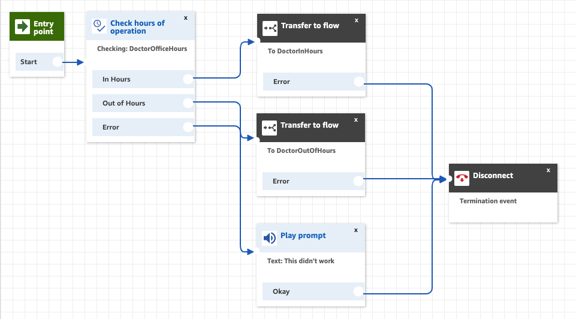
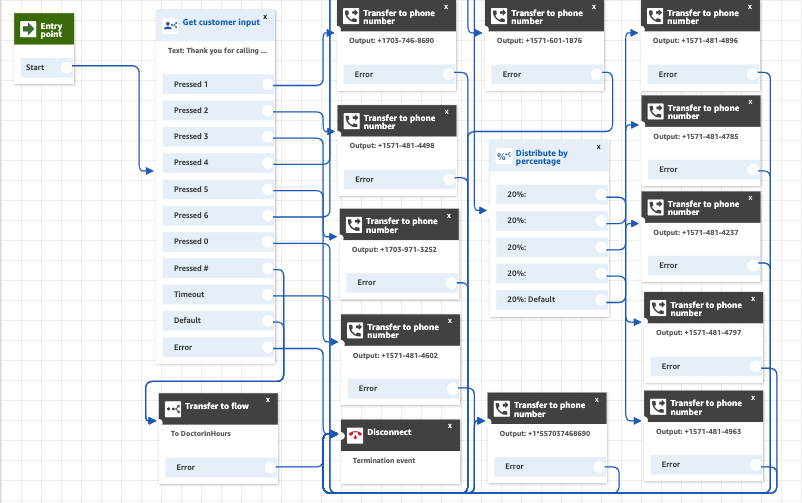
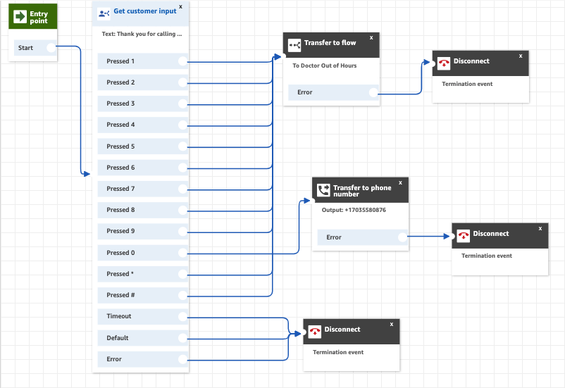

### Introduction
    This repository represents an Amazon Connect call center for my mom's doctor office. Each
    json file represents a contact flow in Amazon Connect. The DoctorOffice file is the main
    contact flow, and it redirects the call to the DoctorInHours contact flow, if the call 
    is happening while the office is open. If the office is closed, it redirects the call to 
    the DoctorOutOfHours contact flow.

    The call center can be reached by calling +1 539-476-2797
___________________________________________________________________________________________________

### Hosting
The call center is deployed as an instance on Amazon Connect. 

___________________________________________________________________________________________________

### Architecture
DoctorOffice Contact Flow:  

DoctorInHours Contact Flow:  

DoctorOutOfHours Contact Flow:  

